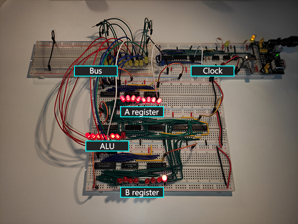

#  8-Bit Breadboard Computer

Welcome to the repository for my implementation of **8-bit breadboard computer** project based on [Ben Eater](https://www.youtube.com/@BenEater)'s videos and schematics. This project is a culmination of my knowledge from electronics and computer architecture courses, where I've put theory into practice to build a fully functional computer from scratch.

[The Simple-As-Possible (SAP)](https://en.wikipedia.org/wiki/Simple-As-Possible_computer) computer is a minimalist design that aims to demonstrate the fundamental concepts of computer architecture in a straightforward way. This project is my attempt to create a similar computer on a breadboard, which I believe is a practical way to understand and appreciate the complexity of computer systems.

<!--- This is an HTML comment in Markdown 
TODO wkleić logo yt na środek zdjęcia

-->

  

## Computer modules
- [x] [Clock](clock.md)
- [x] [Registers](registers.md)
- [x] [ALU](ALU.md)
- [ ] RAM
- [ ] Program Counter
- [ ] Output Register
- [ ] ROM
- [ ] Arduino ROM Programmer
- [ ] Display

## References
- [eater.net](https://eater.net/) - Ben Eater's website
- [r/beneater](https://www.reddit.com/r/beneater/) - subreddit for Ben Eater's projects (helpful while troubletshooting)
- [ElektroPrzewodnik](https://www.youtube.com/@ElektroPrzewodnik), [RS Elektronika](https://www.youtube.com/@RSElektronika) - polish YT channels with theoretical vidoes aboout electronics
- [rolf-electronics](https://github.com/rolf-electronics/The-8-bit-SAP-3) - helpful repository for building SAP-3 8-bit computer

